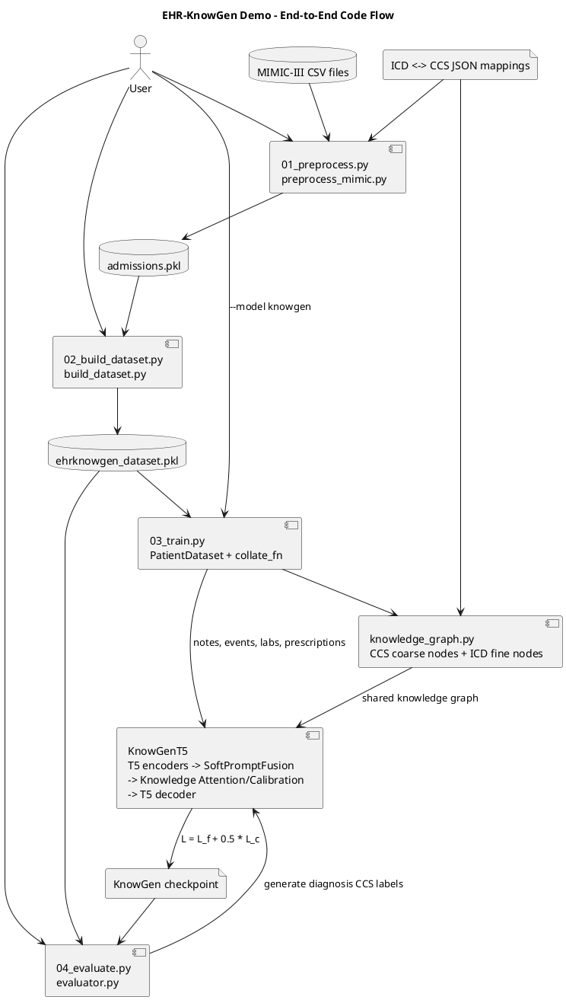
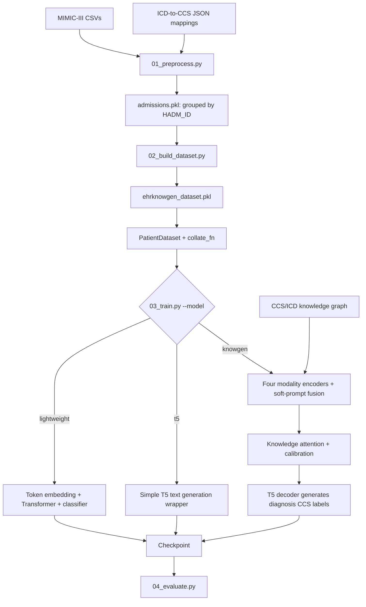
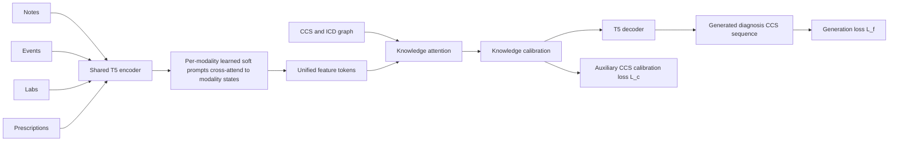

# EHR-KnowGen Demo: Code Flow and Architecture

This guide explains how the repository turns MIMIC-III data into model inputs, how the model is trained, and how the main architecture pieces connect. It describes the code in this project; it is a research-inspired demo, not a claim of exact reproduction of every detail in the paper.

## 1. Repository map

```text
configs/demo_config.yaml             Example settings
scripts/01_preprocess.py             Raw CSV preprocessing entry point
scripts/02_build_dataset.py          Admission record construction entry point
scripts/03_train.py                  Model selection, split, training, checkpoint save
scripts/04_evaluate.py               Checkpoint loading and evaluation
preprocessing/preprocess_mimic.py    Read/join MIMIC-III tables and map ICD to CCS
preprocessing/icd_ccs_mapper.py     ICD/CCS lookup helper
preprocessing/build_dataset.py       Convert processed admissions into model records
preprocessing/knowledge_graph.py    Build the shared CCS-to-ICD graph for KnowGen
dataloader/dataloader_ehrknowgen.py Load pickled admission records
dataloader/collate.py               Batch records and separate modalities
models/lightweight_ehrknowgen.py    Small Transformer classifier
models/t5_ehrknowgen.py             Simple optional T5 wrapper
models/knowgen_t5.py                Multimodal graph-aware T5 generation model
models/model_factory.py             Select a model implementation
engine/trainer.py                   Splits, encoders, optimization loops
engine/evaluator.py                 Metrics and generated-output evaluation
```

## 2. High-level data and model flow

The standalone, renderable PlantUML source is available in [`end_to_end_flow.puml`](end_to_end_flow.puml). Use it when you want a diagram that includes the exact code modules and files.





There are two distinct model concepts in this repository: `lightweight` is the default small classification baseline; `knowgen` is the more complete graph-aware generative path. `t5` is a separate simple wrapper and is not the same as `knowgen`.

## 3. Stage A: preprocess source tables

Run `python scripts/01_preprocess.py`. The script calls `preprocessing.preprocess_mimic.main`.

The current preprocessing code loads:

- `ADMISSIONS.csv` and `PATIENTS.csv` for admission and patient context.
- `DIAGNOSES_ICD.csv` and `PROCEDURES_ICD.csv` for ICD-9 diagnosis and procedure codes.
- `LABEVENTS.csv` for lab observations.
- `NOTEEVENTS.csv` when present.
- `PRESCRIPTIONS.csv` when present, to build a treatment modality.

Rows are grouped/joined using `SUBJECT_ID` and `HADM_ID`. ICD codes are mapped using `ccs_icd_diag.json` and `ccs_icd_proce.json`; the mapper removes periods and whitespace for lookup. Processed artifacts include `admissions.pkl`, per-modality pickle files, and `preprocessing_summary.json`.

`INPUTEVENTS_MV.csv`, `INPUTEVENTS_CV.csv`, and `ICUSTAYS.csv` are not currently consumed. The prescription modality comes from `PRESCRIPTIONS.csv`, not the input-events tables. The `D_ICD_DIAGNOSES.csv` dictionary is used by knowledge-graph construction to get diagnosis titles.

## 4. Stage B: build one record per admission

Run `python scripts/02_build_dataset.py`. `preprocessing/build_dataset.py` reads `admissions.pkl` and writes `ehrknowgen_dataset.pkl`.

A record contains identifiers, notes, labs, prescriptions, procedures/events, diagnosis codes, and CCS labels. `lab_to_text` converts up to `max_labs` observations to strings such as `lab_item_50809: 4.2 mmol/L`. Prescriptions are capped by `max_drugs`. Note text is capped by `max_text_chars`.

The target is `diagnosis_ccs`: the admission's mapped diagnosis categories. Diagnosis codes are intentionally excluded from the input event strings to prevent directly exposing the target. Procedure codes are included as events by default; `--drop-procedures` removes them because procedures may partly reflect the diagnosis or be coded later in the stay.

## 5. Stage C: split, graph, and data batches

`03_train.py` loads records, applies a deterministic train/validation split (`--val-ratio`, default 0.2), and stores validation `HADM_ID`s in the checkpoint. `RecordListDataset` wraps each split. PyTorch `DataLoader` calls `collate_fn` to form batches.

The batch holds four distinct string lists for KnowGen:

- `notes`: clinical note text
- `events`: procedure ICD/CCS strings
- `labs`: formatted laboratory strings
- `prescriptions`: drug/dose/route strings

For `--model knowgen`, the script also calls `build_knowledge_graph` with the training records. It creates a global graph whose coarse nodes are CCS categories and whose fine nodes are diagnosis ICD-9 long titles. Edges connect an ICD node to its CCS parent. The graph is shared across patients; the individual patient's target labels are not used to construct a patient-specific graph at inference.

## 6. KnowGen architecture (`models/knowgen_t5.py`)



### 6.1 Modality encoding and fusion

`KnowGenT5.encode` tokenizes each modality independently and runs each through the same pretrained T5 encoder. `SoftPromptFusion` gives each modality its own learned prompt vectors. Each prompt attends to that modality's encoded token states; the resulting vectors are concatenated into one unified feature sequence. With the default eight prompts per modality, that sequence has 32 feature tokens.

This means modality identity is retained during encoding/fusion, but the current implementation represents data as text strings. It does not currently encode event timestamps, lab time series numerically, or structured medication trajectories.

### 6.2 Graph knowledge and attention

`GraphKnowledgeEncoder` tokenizes graph node names with T5's shared embedding, adds a coarse/fine level embedding, and applies one round of parent/child message passing using the graph adjacency matrix. `KnowledgeAttention` uses the unified EHR features as queries and graph nodes as keys/values, adding attended knowledge to those features.

### 6.3 Calibration and generation

`KnowledgeCalibration` pools the attended features, scores them against coarse CCS node representations, and produces one logit per CCS category. Those logits create a learned gate on the features sent to the decoder. During training, binary cross-entropy against the admission's target CCS set is the calibration loss `L_c`.

The T5 decoder receives the calibrated feature sequence and is trained to generate the target CCS labels as a semicolon-separated string. Its sequence loss is `L_f`. The combined training objective is `L_f + 0.5 * L_c` by default. At evaluation, `generate` produces a string; the evaluator splits on semicolons and calculates exact-label micro precision, recall, and F1. `model.explain` can report top attended graph nodes and top CCS scores, which are model scores rather than a clinical explanation guarantee.

## 7. Other model paths

### Lightweight baseline

`--model lightweight` is the training script default. It builds a whitespace token vocabulary from notes, labs, and events, embeds token IDs, runs a Transformer encoder, pools the sequence, and predicts a multi-label CCS vector with a classification head. Its objective is binary cross-entropy with logits. The lightweight implementation is useful as a CPU-friendly baseline; it does not implement the full graph-aware generative path.

### Simple T5 wrapper

`--model t5` uses `models/t5_ehrknowgen.py` to train a T5 model on combined text and diagnosis-label strings. It is independent of the graph-aware `knowgen` model. Although prompt parameters are declared in that wrapper, the shown forward path does not use them.

## 8. Training and checkpointing

`engine/trainer.py` owns the three training loops. The KnowGen loop calls the model with batch modalities and target CCS strings/lists, backpropagates the combined loss, clips gradient norm, and updates parameters with AdamW. `scripts/03_train.py` saves the model weights, base model name, graph (KnowGen), and held-out admission IDs.

Example command for the graph-aware architecture:

```powershell
python scripts/03_train.py --model knowgen --epochs 10 --max-samples 100
```

The default command without `--model knowgen` trains the lightweight model instead. T5-based paths require the `transformers` dependency and may need to download model weights.

## 9. Evaluation

`04_evaluate.py` loads all records and filters them to the checkpoint's stored validation IDs unless `--full` is supplied. For a KnowGen checkpoint (detected by the saved graph), it rebuilds the model with that graph and calls `evaluate_knowgen`. This generates label strings and compares their parsed CCS sets with the ground truth. `--full` includes training records, so those results are not a held-out evaluation.

## 10. Interpretation and limitations

- The validation partition is a held-out split, not a separate final test cohort.
- Procedure events may reveal care delivered after the diagnosis was already suspected or established. Use `--drop-procedures` when you need a cleaner prediction-time input definition.
- Prescriptions can also be diagnosis-informative. Report that treatment data is included and define the time at which a prediction is intended.
- If notes are absent or empty, the notes encoder receives the fallback string `none`; check `preprocessing_summary.json` and the source data before interpreting results.
- The graph and model implement a practical approximation. Confirm mapping direction, code normalization, graph coverage, and target format for the exact dataset in use.
- Generated CCS labels are structured category predictions, not a free-form diagnosis narrative and not a clinical decision.

## 11. Suggested run order

```powershell
python scripts/01_preprocess.py
python scripts/02_build_dataset.py
python scripts/03_train.py --model knowgen --epochs 10 --max-samples 100
python scripts/04_evaluate.py --checkpoint checkpoints/ehrknowgen_demo_knowgen.pt
```

For the procedure-excluded dataset, rebuild it with `python scripts/02_build_dataset.py --drop-procedures` before training. Keep a copy of the resulting dataset/configuration if you need reproducible comparisons.
